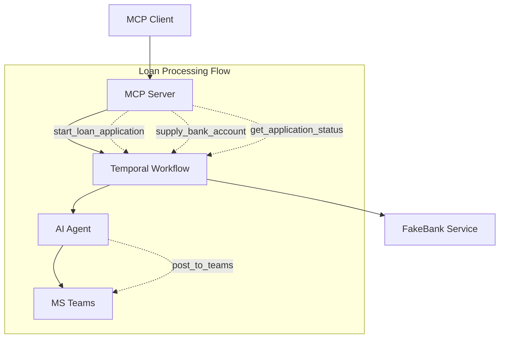

# Home Loan MCP Agent

An AI-powered home loan underwriting system using Pydantic AI, Temporal workflows, and MCP (Model Context Protocol) server.

## Components

- **Agent**: AI underwriter that analyzes loan applications
- **Workflow**: Temporal workflow for loan processing
- **MCP Server**: Tools for loan application management
- **FakeBank**: Mock banking service for testing

## Architecture



## Setup

Install dependencies:
```bash
uv install
```

Start Temporal server (required):
```bash
temporal server start-dev
```

Start FakeBank service:
```bash
uv run python fakebank/main.py
```

Start Temporal worker:
```bash
uv run python worker.py
```

Start MCP server:
```bash
uv run python server.py
```

## Usage

The MCP server provides tools for:
- `start_loan_application`: Begin loan processing
- `supply_bank_account`: Provide bank account verification
- `get_application_status`: Check application status
- `post_to_teams`: Post application details to MS Teams for approval

Test accounts: `123-456`, `654-321`

## Configuration

Set the Teams webhook URL:
```bash
export TEAMS_WEBHOOK_URL="https://your-org.webhook.office.com/webhookb2/..."
```